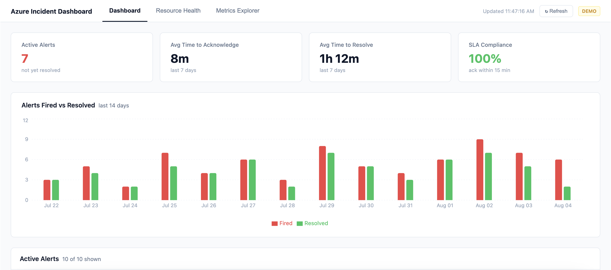

# Azure Incident Dashboard

A real-time cloud operations dashboard built with React and the Azure Monitor REST API. Gives support engineers and SREs a unified view of active alerts, resource health, and infrastructure metrics.

**[Live Demo](https://purple-rock-0247a5d10.7.azurestaticapps.net)**

---

## What it does

- **Dashboard** — Live alert feed with severity triage, MTTA/MTTR/SLA metrics, and a 14-day resolution timeline
- **Alert Drawer** — Click any alert to see full incident detail, timestamps, duration calculations, and action buttons
- **Resource Health** — Grid view of monitored resources with health status and active alert counts
- **Metrics Explorer** — Interactive line charts for CPU, memory, request count, and more across any resource and time range
- **Real-time polling** — Alerts refresh every 30 seconds with a manual refresh option
- **MSAL Auth** — Azure AD authentication with silent token renewal for live data mode

---

## Screenshots



---

## Tech stack

| Layer | Technology |
|---|---|
| Frontend | React 18, Vite |
| Charts | Recharts |
| Auth | MSAL (@azure/msal-browser, @azure/msal-react) |
| API | Azure Monitor REST API, Azure Resource Health API |
| Deploy | Azure Static Web Apps (free tier) |

---

## Run locally (demo mode — no Azure account needed)

```bash
git clone git@github.com:tdberg21/azure-incident-dashboard.git
cd azure-incident-dashboard
npm install
npm run dev
```

Open `http://localhost:5173` — runs with mock data by default.

---

## Run with live Azure data

**1. Create an Azure AD app registration**

Azure Portal → App registrations → New registration
Name: azure-incident-dashboard
Redirect URI: Single-page application → http://localhost:5173
API permissions: Azure Service Management → user_impersonation


**2. Configure environment**

```bash
# .env.local
VITE_AZURE_CLIENT_ID=your-client-id
VITE_AZURE_TENANT_ID=your-tenant-id
VITE_AZURE_SUBSCRIPTION_ID=your-subscription-id
```

**3. Switch to live mode**

In `src/hooks/useAlerts.js` and `src/App.jsx`, set:
```js
const DEMO_MODE = false
```

---

## Architecture

```
src/
├── api/          # Azure Monitor API calls + mock data
├── auth/         # MSAL configuration
├── components/   # AlertFeed, AlertDrawer, MetricCards,
│                 # ResourceGrid, MetricsExplorer, Charts
├── hooks/        # useAlerts (polling), useAuth (MSAL)
└── utils/        # formatters (MTTR, MTTA, SLA), severity config
```

**Key decisions:**
- **Demo mode by default** — interviewers can run it in 3 commands with no Azure setup
- **Polling over WebSockets** — simpler to deploy; WebSocket upgrade is the obvious next step
- **Mock data mirrors real API shape** — swapping to live data requires one flag change, not a rewrite
- **Severity/status config centralized** — all colors defined once in `severity.js`, never hardcoded in components

---

## What I'd add next

- WebSocket connection to Azure Event Grid for push-based alert updates
- Email/Teams notifications via Azure Logic Apps
- Multi-subscription support
- Historical MTTR trend with moving average
- Export incidents to CSV/PDF

---

## Related experience

Built to mirror the alert triage workflows I ran daily as a Technical Support Engineer L3 at Teknowledge, where I owned Azure incident escalations for enterprise accounts.